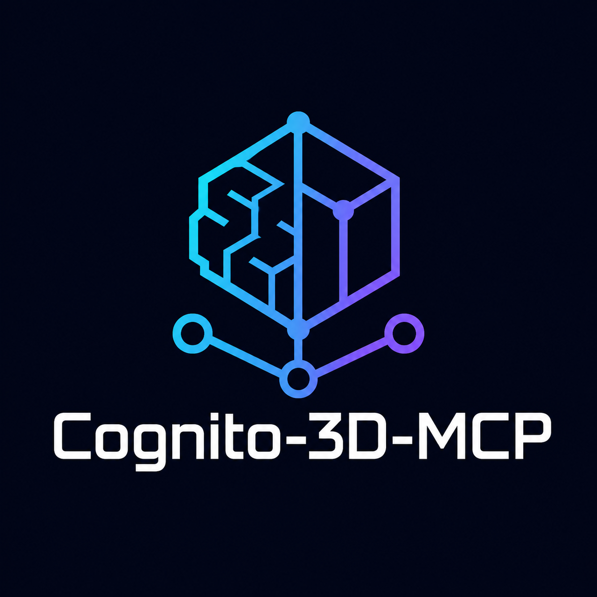
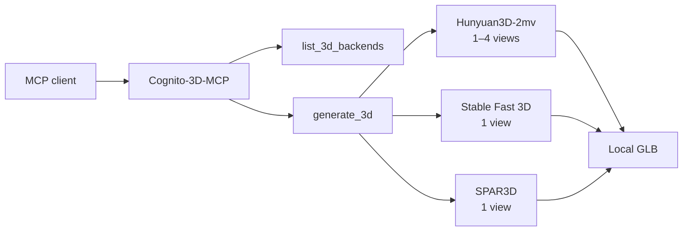

<p align="center">
  
</p>

<p align="center">
  <strong>Local image-to-3D generation for MCP clients.</strong><br>
  Turn one or more reference images into a GLB through a small, model-agnostic tool surface.
</p>

# Cognito-3D-MCP

Cognito-3D-MCP is a local [Model Context Protocol](https://modelcontextprotocol.io/)
server that gives AI agents a consistent way to create 3D assets from images. It
routes each request to one of three generation engines while keeping model files,
input images, and generated meshes on your machine.

The server currently integrates Hunyuan3D-2mv as its built-in multiview engine,
with optional Stable Fast 3D and SPAR3D adapters for single-image generation.

## Why Cognito

- **One tool surface** — switch generation engines without changing MCP clients.
- **Multiview input** — provide front, left, back, and right references when using
  the default engine.
- **Local by design** — images and generated GLB files remain in paths you control.
- **Backend discovery** — clients can inspect which engines are configured before
  starting a GPU-heavy job.
- **Safe runtime isolation** — optional engines run in their own Python
  environments to avoid native dependency conflicts.
- **Reproducible controls** — configure seed, inference steps, guidance, mesh
  resolution, and texture resolution through the MCP call.

## How it works



GPU generation jobs are serialized so multiple MCP calls do not compete for the
same device.

## Requirements

- Python 3.10 or newer
- A PyTorch installation supported by your hardware
- The dependencies and model access required by the generation engine you intend
  to use
- An MCP-compatible client such as Codex, Claude Desktop, or another local host

The default engine is GPU-oriented and normally expects CUDA. Model weights are
not stored in this repository.

## Install

```bash
git clone https://github.com/Lanc3/Cognito-3D-MCP.git
cd Cognito-3D-MCP
python -m pip install -e ".[mcp]"
```

Copy `.env.example` into your environment configuration and adjust the paths for
your machine. The default settings use the Hunyuan3D-2mv checkpoint:

```env
HUNYUAN3D_MODEL_PATH=tencent/Hunyuan3D-2mv
HUNYUAN3D_SUBFOLDER=hunyuan3d-dit-v2-mv
HUNYUAN3D_VARIANT=fp16
HUNYUAN3D_DEVICE=cuda

HY3D_MCP_OUTPUT_ROOT=outputs/mcp
HY3D_MCP_JOB_TIMEOUT=1800
```

Run the server over stdio:

```bash
cognito-3d-mcp
```

You can also run it as a Python module:

```bash
python -m hy3dgen_mcp.server
```

## Connect an MCP client

Use an absolute repository path in your client configuration:

```json
{
  "mcpServers": {
    "cognito-3d": {
      "command": "python",
      "args": ["-m", "hy3dgen_mcp.server"],
      "cwd": "/absolute/path/to/Cognito-3D-MCP"
    }
  }
}
```

Restart the client after changing its MCP configuration.

## Tools

### `list_3d_backends`

Reports each engine's availability, configuration summary, and whether it is the
default. Call this first when the client should choose an engine dynamically.

### `generate_3d`

Creates a GLB from local image files.

| Parameter | Purpose | Default |
|---|---|---|
| `front_image` | Absolute path to the required front image | Required |
| `backend` | `hunyuan3d`, `sf3d`, or `spar3d` | `hunyuan3d` |
| `left_image` | Optional left reference for the multiview engine | — |
| `back_image` | Optional back reference for the multiview engine | — |
| `right_image` | Optional right reference for the multiview engine | — |
| `output_dir` | Destination directory for the generation job | Auto-generated |
| `seed` | Reproducibility seed | `12345` |
| `steps` | Inference steps, from 1 to 200 | `50` |
| `guidance_scale` | Model guidance strength | `5.0` |
| `octree_resolution` | Mesh extraction resolution, from 32 to 1024 | `384` |
| `texture_resolution` | Texture size for supporting engines, from 256 to 4096 | `1024` |

Accepted input formats are PNG, JPEG, and WebP. Only the default `hunyuan3d`
engine accepts the optional left, back, and right views. Successful calls return
the backend name, output path, input views, and a status message.

## Generation engines

| Engine | Input | Integration |
|---|---|---|
| Hunyuan3D-2mv | 1–4 canonical views | Built in and selected by default |
| Stable Fast 3D | Single front image | Optional isolated installation |
| SPAR3D | Single front image | Optional isolated installation |

To enable Stable Fast 3D or SPAR3D, install the engine from its official source
in a separate environment, then configure its repository root and Python
executable:

```env
SF3D_ROOT=/absolute/path/to/stable-fast-3d
SF3D_PYTHON=/absolute/path/to/sf3d/environment/python

SPAR3D_ROOT=/absolute/path/to/stable-point-aware-3d
SPAR3D_PYTHON=/absolute/path/to/spar3d/environment/python
```

Cognito-3D-MCP does not download or redistribute those projects or their model
weights.

## Output

Each job writes `mesh.glb` into a unique directory under `outputs/mcp/` unless
`output_dir` is provided. Generated outputs are excluded from Git by default.

## Development

Run the focused MCP test suite with:

```bash
python -m unittest discover -s tests -v
```

See [CONTRIBUTING.md](CONTRIBUTING.md) for contribution guidance and
[SECURITY.md](SECURITY.md) for private vulnerability reporting.

## License and provenance

Cognito-3D-MCP is built on imported Hunyuan3D inference source and remains
subject to the bundled [LICENSE](LICENSE) and [NOTICE](NOTICE). Those terms
include use, territory, distribution, and attribution restrictions, so this
repository is source-available and is not represented as OSI-approved open
source. Optional engines have their own licenses and model-access terms.

See [UPSTREAM.md](UPSTREAM.md) for the exact upstream repository and pinned
commit used by this project.
